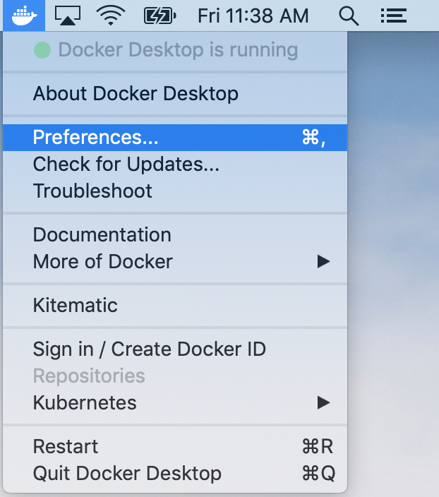

# User Guide

## Background

The Alaska Satellite Facility (ASF) has developed an advanced product toolbox (TBX) capable of conducting Radiometric Terrain Correction (RTC) with Sentinel-1 data named S-1TBX RTC. The toolbox provides automated fetching of data from ASF's datapool (https://vertex.daac.asf.alaska.edu), Digital Elevation Map (DEM) selection and stitching, and bundles the European Space Agency's Sentinel Application Platform (SNAP) toolbox with a recipe for processing RTC products from start to finish. This allows users to begin with a single granule name and in one command produce RTC analysis ready Sentinel-1 end products.

Distortions in Synthetic Aperture Radar (SAR) imagery are induced by the side-looking nature of SAR sensors and are compounded by rugged terrain. RTC corrects geometric distortions that lead to geolocation errors by moving image pixels into the proper spatial relationship with one another based on a DEM. RTC removes the misleading influence of topography and backscatter values, combining both corrections to produce a superior product for science application and analysis.

## Output Products
- GeoTIFF image with 
    - 30 meter pixel spacing
    - Pixel values indicate gamma-0 power
    - Projected in Universal Transverse Mercator (UTM) coordinates
- ArcGIS compatible ISO 19115 metadata

## System Requirements

* Operating System
    - macOS 10.11 or later 
    - Ubuntu 18.04 or later
    - CentOS 7 or later
* 64-bit installation
* 16 GB of RAM
* 20 GB of available hard disk space

## Installation

<details><summary>macOS</summary>

1. Download the [Docker for Mac](https://download.docker.com/mac/stable/Docker.dmg) installer (~500 MB).

1. Double-click Docker.dmg to open the installer, then drag Moby the whale to the Applications folder.

   <p align="center"></p>

1. Double-click Docker.app in the Applications folder to start Docker, then follow any installation prompts.  When complete, "Docker Desktop is now up and running!" should be displayed.

   **Note:** A Docker ID is not required.

   <p align="center"></p>
   
   <p align="center"></p>

1. Click the Docker icon in the top status bar and select "Preferences".

   <p align="center"></p>

   1. Select "Advanced".
   1. Set "CPUs" to 4 or higher. More CPUs means faster processing, but may leave fewer resources for other programs during processing.
   1. Set "Memory" to 16.0 GiB or higher.
   1. Click "Apply & Restart" and wait for the green "Docker Engine is running" message to reappear.
   
   <p align="center"></p>

1. Download [**s1tbx-rtc.sh**](https://asfdaac.s3.amazonaws.com/s1tbx-rtc.sh) to the directory where RTC products should be saved.

</details>

<details><summary>Ubuntu 18.04</summary>

1. Install Docker using apt
   ```
   sudo apt update
   sudo apt install -y docker.io
   ```
1. Add your user to the docker group
   ```
   sudo usermod -aG docker $USER
   ```
1. Log out and log back in for the group change to take effect
1. To verify everything is working run the docker command
   ```
   docker run hello-world
   ```
   Confirm you see the following in your output
   ```
   Hello from Docker!
   This message shows that your installation appears to be working correctly.
   ```
1. Download **s1tbx-rtc.sh** to the directory where RTC products should be saved
   ```
   wget https://raw.githubusercontent.com/asfadmin/grfn-s1tbx-rtc/master/scripts/s1tbx-rtc.sh
   ```
</details>

<details><summary>CentOS 7</summary>

1. Install Docker
   ```
   curl -fsSL https://get.docker.com/ | sh
   ```
1. Create a docker group and add your user to it
   ```
   sudo groupadd docker
   sudo usermod -aG docker $USER
   ```
1. Log out and log back in for the group change to take effect
1. Start Docker
   ```
   sudo service docker start
   ```
1. To verify everything is working run the docker command
   ```
   docker run hello-world
   ```
   Confirm you see the following in your output
   ```
   Hello from Docker!
   This message shows that your installation appears to be working correctly.
   ```
1. Download **s1tbx-rtc.sh** to the directory where RTC products should be saved
   ```
   wget https://raw.githubusercontent.com/asfadmin/grfn-s1tbx-rtc/master/scripts/s1tbx-rtc.sh
   ```
</details>

## Usage

1. Find the name of the GRD or SLC granule to process from [Vertex](https://vertex.daac.asf.alaska.edu/).
   
   *The examples below use S1B_IW_GRDH_1SDV_20190430T161529_20190430T161554_016038_01E295_771B*.

1. **macOS only**

   1. Open the Terminal app

      <p align="center"></p>
   
   1. In your Terminal window, navigate to the directory where **s1tbx-rtc.sh** is saved.
   
      *For example, if you saved the script to your Downloads directory, type:*
      ```
      cd ~/Downloads
      ```

1. Execute **s1tbx-rtc.sh** with the granule name and desired options
   ```
   sh s1tbx-rtc.sh --granule S1B_IW_GRDH_1SDV_20190430T161529_20190430T161554_016038_01E295_771B
   ```
   Processing can take up to several hours depending on the granule, internet connection, and computer resources

1. Upon completion, RTC products will appear in the directory where **s1tbx-rtc.sh** was executed
   ```
   S1B_IW_GRDH_1SDV_20190430T161529_20190430T161554_016038_01E295_771B_VH_RTC.tif
   S1B_IW_GRDH_1SDV_20190430T161529_20190430T161554_016038_01E295_771B_VH_RTC.tif.xml
   S1B_IW_GRDH_1SDV_20190430T161529_20190430T161554_016038_01E295_771B_VV_RTC.tif
   S1B_IW_GRDH_1SDV_20190430T161529_20190430T161554_016038_01E295_771B_VV_RTC.tif.xml
   ```
## Additional Options

```
sh s1tbx-rtc.sh --granule GRANULE [--username USERNAME] [--password PASSWORD] [--demSource {ASF,ESA}]
                [--layover] [--incidenceAngle] [--clean]
```

| Option                 | Description   | 
|:---------------------- |:-------------| 
| --granule | Sentinel-1 granule name. SLC and GRD granules are supported. |
| --username | Earthdata Login username. |
| --password | Earthdata Login password. |
| --demSource |Source for digital elevation models: Geoid-corrected NED/SRTM sourced from ASF, or SRTM sourced from ESA. The default is ASF. |
| --layover| Include layover shadow mask in output. | 
| --incidenceAngle | Include projected local incidence angle in output.     | 
| --clean |Set very small pixel values to No Data. Helpful to clean edge artifacts of granules processed before IPF version 2.90 (3/13/2018). May adversely affect valid data.  | 
